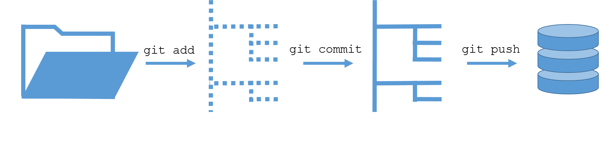
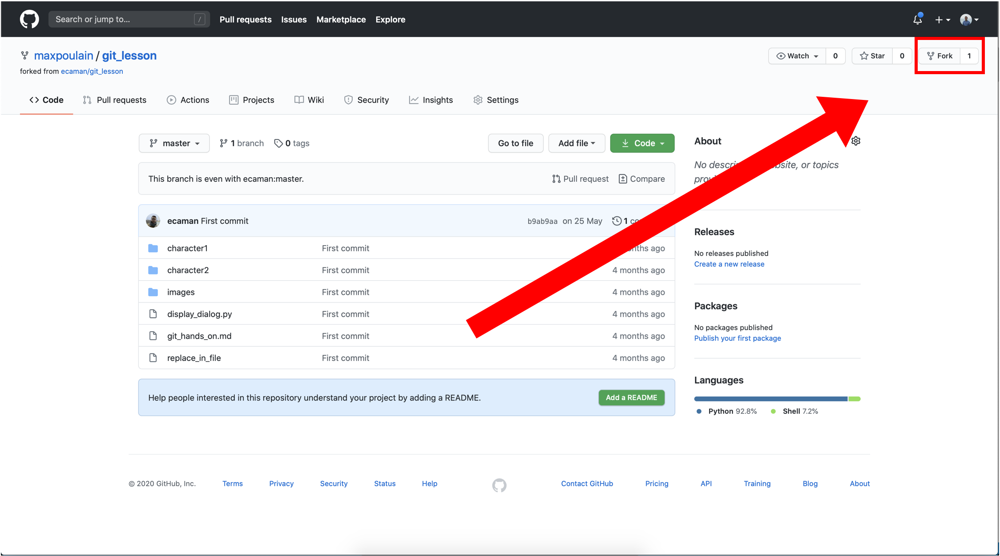

# CRI Bootcamp Expert: Git Hands on

## Reminder
The staging policy is composed of 4 steps that you can see in the following drawing:



Of course each command could be reversed, but some of them are harder to reverse than other. We will cover them in this tutorial.

# Let's go for some git
#### You will work on a project that is using git. 
#### In this project you will have some ***character1.txt*** files and some ***character2.txt*** files. 
#### They are played by a python script that will display the questions and the answers. 
#### Your mission will be to edit thoses questions and answers files to correct mistakes and forgotten stuff in order to be the same as they were in the well-known movies they are from.
<br/>
<br/>


<br/>
<br/>
#### - There are 10 exercices and for each one you will have to answer to some questions. For this you will have to write the line of code that anwser to the question in the dedicated cell (starting with `#Your answer`.)
#### - All the actions that you will have to do will always be written in **<font color='#ffb799'> this color</font>**
#### - You will find a great documentation about git on the cheat-sheet that will be given during the learning session.

# Exercise 1: Fork the project
1. Click on **Fork**

2. It's done ! Repository is forked, so now this project is in you own github repository, you can push all commits you want ! ;)

# Exercise 2: Cloning

<br/>
<br/>
#### In this exercise we want you to clone a repository, this repository is available at: https://github.com/<_YOUR_GITHUB_USERNAME_>/git_lesson
#### If you can't access to it or if the repository's name is wrong please let us know.
<br/>


```bash
# Your answer
git clone git@github.com:ziqingcheryl/git_lesson.git
```

If everything is good you should see a directory named **git_lesson** in the following output:


```bash
# Run this
ls
```

Is it good? Perfect, now we will just go inside this dowloaded directory for the following exercices. 

**<font color='#ffb799'>Please replace the path with the name of your git repository:</font>**


```bash
# Run this
cd git_lesson
```

# Exercise 3: Commit
#### In this exercise you will do your firsts commits.
#### To do this you will work on the dialogs from your first TV serie, **Game of Thrones**


Let's see how to run the scene.


```bash
# Run this
python display_dialog.py --char1 character1/Ygritte.txt --char2 character2/Jon.txt
```

Your job will be to replace the last line of the dialog, don't worry I wrote a script for that you will just have to specify by what you want to replace it.

**<font color='#ffb799'>Go ahead replace the Ygritte [???] by what she should say. (replace the [???] in the following cell by your text).</font>**


```bash
# Your answer
sh replace_in_file character1/Ygritte.txt "Really? Eat my sword!""
```

Perfect now that you have done a modification on a file, you can commit it on git.

**<font color='#ffb799'>Use `git commit -m` to commit your changes</font>** The `-m` option is used to specify a git commit message, it is mandatory so watch out!


```bash
# Your answer
git commit -m 'Ygritte'
```

Did not work? that's normal you can't commit files that you did not add to your local changes. To see the files that have changes we usually use `git status`


**<font color='#ffb799'>Try again but this time add the files where you have done some changes and commit them</font>**


```bash
# Run this
git status
```


```bash
# Your answer
git add .
```


```bash
# Your answer
git commit -m 'Ygritte'
```

**Bravo!** You have done you're first commit

# Exercise 4: Push
#### We will continue to work on this **Game Of Thrones** dialog for this exercise. Your goal is now to push your changes to the remote server that is on GitHub.

**<font color='#ffb799'>Go ahead push your commit to the remote server!</font>**


```bash
# Your answer
git push origin master
```

Easy right? Now you can check that everything is ok on the github page.

You just pushed to the master branch your commit. You can also commit multiple times before pushing to the master branch. It will push all your local commits to the remote server at the same time and you could still keep track of every commits you've done.

> ***Pro-tips:***
> - The `git status` command is really useful, use it every time you have a doubt on something, the provided informations are gold and it can't break anything!
>
>
> - The `git add` command can lead to some traps. you can use `git add .` or `git add *` to add all edited and new files that you currently have, but using this can lead to adding unnecessary files to the git remote. (just imagine that you accidently push a 1Tb Dataset that you just copied...). **Our advice is to add each file one by one whenever you are not familiar with git.**
>
>
> - In fact you can create and add a `.gitignore` to git. In this file you can list all things that should not be tracked by git. For example you can add `*.csv` in the gitignore file to avoid tracking CSV files.
>
>
> - Keep in mind that if you don't specify a branch, you will always push to the branch you are currently on. You can check which branch you are on using `git status`.
>
>
> - If you want to be sure to push to the branch that you want, to avoid any error for example, you can use `git push origin BRANCHNAME`

# Exercise 5: Repeat
#### Because repetition is a learning enabler, now you will have to repeat **Exercise 2** and **Exercise 3** for the following dialogs:
> - Dr. No (*Sylvia Trench* and *James Bond*)
> - Fight Club (*Tyler*)
> - Appollo 13 (*Jack Swigert*, *CAPCOM* and *Jim Lovell*)
> - Back to the future part II (*Marty McFly*, *Doc Emmet Brown* and *Biff Tannen*)

### 5.1 Dr. No


```bash
# Run this
python display_dialog.py --char1 character1/James.txt --char2 character2/Sylvia.txt
```

**<font color='#ffb799'>Let's edit this</font>**


```bash
# Your answer
sh replace_in_file character1/James.txt "Bombaya"
```

**<font color='#ffb799'>And now update changes on remote server</font>**


```bash
# Your answer
git add .
```


```bash
# Your answer
git commit -m 'bond'
```


```bash
# Your answer
git status
```


```bash
# Your answer
git push origin master
```

### 5.2 Fight Club


```bash
# Run this
python display_dialog.py --char1 character1/voice_fc.txt --char2 character2/Tyler.txt
```

**<font color='#ffb799'>Let's edit this</font>**


```bash
# Your answer
sh replace_in_file character2/Tyler.txt "You do not talk about fight club."
```

**<font color='#ffb799'>And now update changes on remote server</font>**

```bash
# Your answer
git add .
```


```bash
# Your answer
git commit -m 'fight'
```


```bash
# Your answer
git status
```


```bash
# Your answer
git push origin master
```

### 5.3 Apollo 13


```bash
# Run this
python display_dialog.py --char1 character1/appollo13.txt --char2 character2/Jim.txt
```

**<font color='#ffb799'>Let's edit this</font>**


```bash
# Your answer
sh replace_in_file character2/Jim.txt "I've been captured by aliens!"
```

**<font color='#ffb799'>And now update changes on remote server</font>**


```bash
# Your answer
git add .
```


```bash
# Your answer
git commit -m 'apollo'
```


```bash
# Your answer
git status
```


```bash
# Your answer
git push origin master
```

### 5.4 Back to the future part II


```bash
# Run this
python display_dialog.py --char1 character1/Marty.txt --char2 character2/Emmet.txt
```

**<font color='#ffb799'>Let's edit this</font>**


```bash
# Your anwser
sh replace_in_file character2/Emmet.txt "Let's fly instead"
```

**<font color='#ffb799'>And now update changes on remote server</font>**


```bash
# Your answer
git add .
```


```bash
# Your answer
git commit -m 'back'
```


```bash
# Your answer
git status
```


```bash
# Your answer
git push origin master
```

# Exercise 6: Revert a local commit
#### For this exercise we will work on **Star Wars: Episode V - The Empire Strikes Back**. (watch out for Mandela effects)

#### The goal will be to do multiple commits and to revert them. Keep in mind that you can commit as much as you want before using push to update the remote server.


```bash
# Run this
python display_dialog.py --char1 character1/DarthVader.txt --char2 character2/Luke.txt
```

For this time I'll give you the answer, Luke said *"NOOOOOOOOOOOOOO NOOOOOOOO"* twice, just like this.

**<font color='#ffb799'>Let's edit this with the answer I gave you</font>**


```bash
# Your answer
sh replace_in_file character2/Luke.txt "NOOOOOOOOOOOOOO NOOOOOOOO"
```

**<font color='#ffb799'>Now commit your changes (but don't push)</font>**


```bash
# Your answer
git add .
```


```bash
# Your answer
git commit -m 'future'
```


```bash
# Your answer
git status
```

Ok, in fact I was wrong Luke didn't said it twice, it think it was just one simple *"NOOOOO"*.

**<font color='#ffb799'>Please manually replace your last updates with the new value</font>**


**<font color='#ffb799'>Now commit (again) your changes (but don't push)</font>**


```bash
# Your answer
sh replace_in_file character2/Luke.txt "NOOOOO"
```


```bash
# Your answer
git add .
```


```bash
# Your answer
git commit -m 'future2'
```

Well after reviewing the scene (that you can find just here: https://www.youtube.com/watch?v=bv20ZoBcdO8 we were right in the first place.

**<font color='#ffb799'>Reset the last commit to come back to the status we have with the two *"NOOOOOO!"*</font>**


```bash
# Your answer
git reset HEAD~1
```


```bash
# Your answer
git status
```


```bash
python display_dialog.py --char1 character1/DarthVader.txt --char2 character2/Luke.txt
```

**<font color='#ffb799'>Push your changes to the remote server.</font>**


```bash
# Your answer
git add .
```


```bash
# Your answer
git push origin master
```

You just reverted a local commit and pushed, well done!

> ***Pro-tips:***
> - The `git reset HEAD~1` is pretty simple if you want to go back in time for 5 commits you just have to replace the 1 by a 5. 
>
> - Another way of doing this can be to find the commit id you want to go back and use: `git reset --soft commit_id`


# Exercise 7: Revert a commit on Remote server.
#### Sometimes it can happen that you code a whole feature and that after pushing to the remote server you realize that a lot of what you have done was wrong. If so, you have 2 options:
#### - Do a new commit that will delete your changes
#### - Reset the commit on the remote server
#### For this exercise we will do the last option, because it can be complicated to delete all changes, you can forget something.
<br/>

#### The movie dialog for this exercise will be from Forrest Gump.


```bash
# Run this
python display_dialog.py --char1 character1/Forrest.txt --char2 character2/Lady.txt
```

**<font color='#ffb799'>Let's edit the file and push changes to the remote server.</font>**


```bash
# Your answer
sh replace_in_file character1/Forrest.txt "life is a bot of chocolate."
```


```bash
# Your answer
git add . 
```


```bash
# Your answer
git commit -m 'gump'
```


```bash
# Your answer
git status
```


```bash
# Your answer
git push origin master
```

Perfect now let's imagine that we want to go back to the status we had before this exercise.

**<font color='#ffb799'>Find the commit ID and revert it on the remote server.</font>**


```bash
# Your answer
git reflog
```


```bash
# Your answer
git revert 6516494 
```


```bash
# Your answer
git add .
```


```bash
# Your answer
git commit -m 'gump2'
git push origin master
sh replace_in_file character1/Forrest.txt "life is a bot of chocolate."
git add .
git status
git commit -m 'gump_inbranch'
git push origin gump
```

# Exercise 8: Creating a branch 

***<font color='#ffb799'>Questions</font>***
- **<font color='#ffb799'>Create a new branch and go on it.</font>**
- **<font color='#ffb799'>Do the Forrest Gump correction (like in the begining of the previous exercise) and push it on the new branch.</font>**

```bash
 # My answer
 git branch gump
 git checkout gump
 sh replace_in_file character1/Forrest.txt "life is a bot of chocolate."
 git status
 git add .
 git commit -m "gump_inbranch"
 git push origin gump
 ```

# Exercise 8: Changing Branch 
#### We will work with our last movie **Titanic** let's see the dialog:


- **<font color='#ffb799'>Go back to master branch</font>**
- **<font color='#ffb799'>edit answer/Jack.txt file with the replace_in_file script</font>**
- **<font color='#ffb799'>Push changes to the master branch</font>**

```bash
#My answer
git branch
git checkout master
sh replace_in_file character2/Jack.txt "KING OF THE WORLD"
git add .
git commit -m 'jack'
git push origin master
```

# Exercise 9: Merging two branches 
#### Now we will merge the branch you created into the master branch.
***<font color='#ffb799'>Questions</font>***
- **<font color='#ffb799'>Merge the branch you created in Exercise 7 in the master branch</font>**
<br/>
<br/>

```bash
#My answer
git merge gump
git push origin master
```

***Pro-tips***
> - Merging branches is not so trivial it could leads to conflicts. Normally you did not have any in the previous exercise and we will conver how to handle them in the next git learning session.
>
> - Working with branches is the best way to use git, and we don't recommend to push stuff on the master branch, even if it's just your project. The master branch should always remain a pure and free-of-bugs zone.
> 


# If you came this far, you have finished the first part!! well done!

# To go further:
- **Do exercices here: https://learngitbranching.js.org/**
- **Find two friends and:**
Try to put one by one the names of all the attendees of the session, all at the same time in a file. This will obviously generate conflicts that you'll have to manage.

